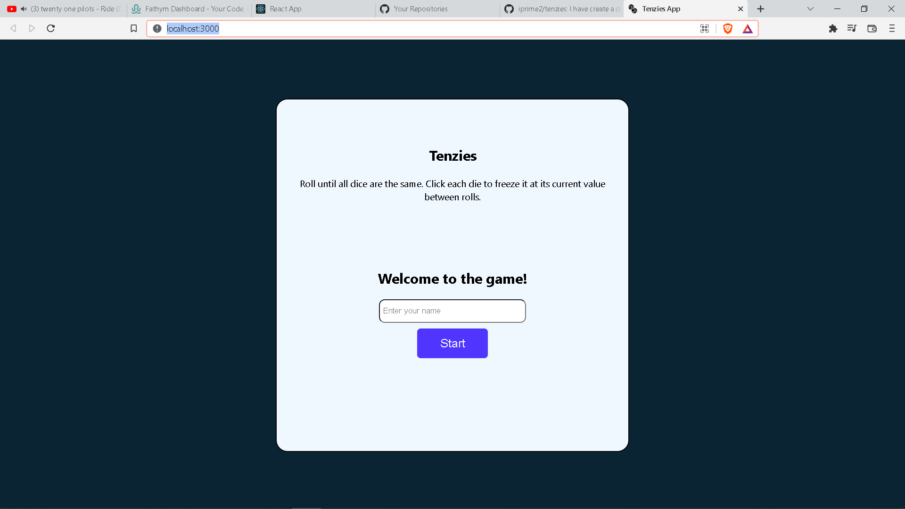
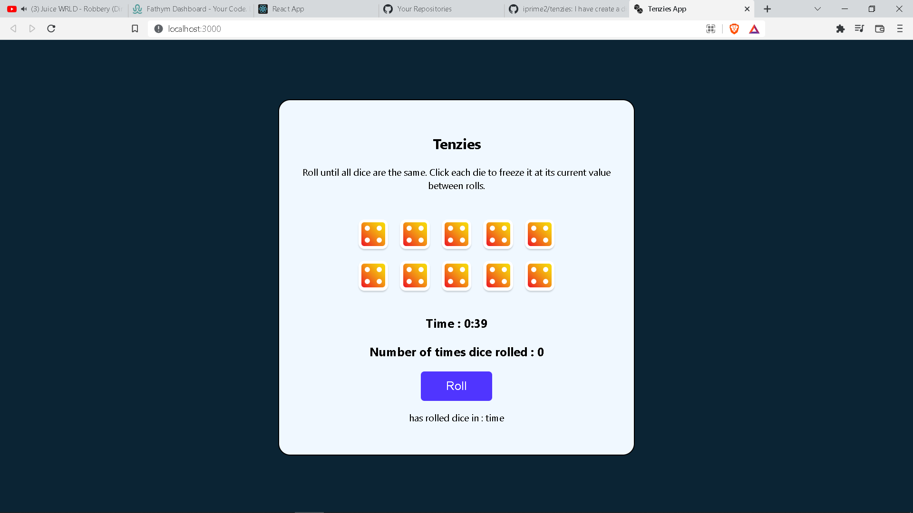

############################################################################

Welcome!

I have created a Game using React JS.

In this game you have to select same dice in order to win the game.

My webapp count how many time the dice is rolled and even counts time taken by the player to finish the game.

Whenever you will press Roll button some random number is drawn and there six different images of dice
which is selected on the basis of  number drawn

I have attached the link to webapp please feel free to visit my webapp

https://003812183be6-shared.lowcodeunit.com/

with regards,

Sushil Kumar Gupta

kalwarsushil2@gmail.com
##################################################################################
